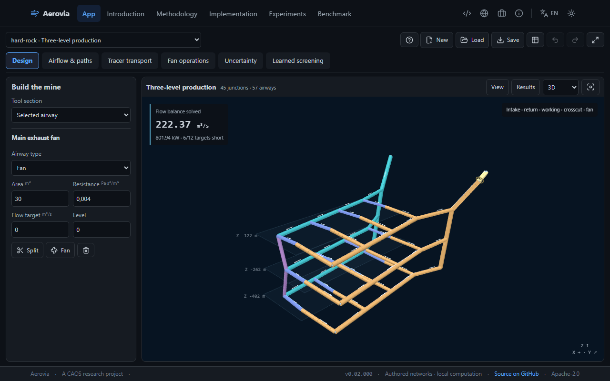
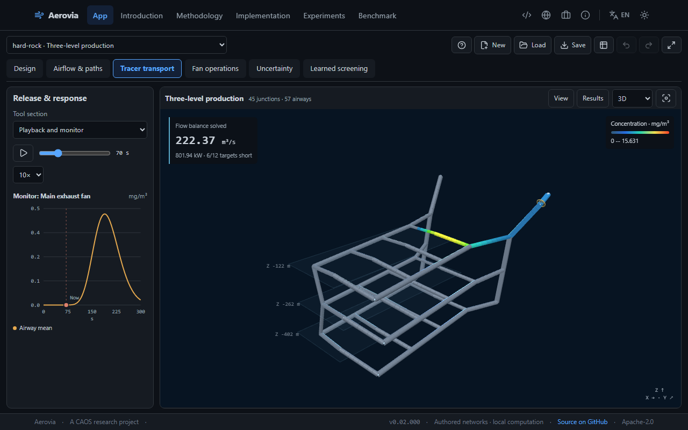

# Aerovia

**Design an underground ventilation network, change its operation, and inspect the resulting airflow and tracer history.**

[Open the app](https://aerovia.fasl-work.com/) · [Documentation](docs/README.md) · [Run locally](docs/guides/01_local.md) · [Design and transport](docs/guides/05_spatial-and-transport.md) · [Train the models](docs/methods/surrogates.md)



Aerovia combines direct spatial authoring, pressure-flow analysis, conservative passive transport and two actual trained airflow surrogates. Draw or import a network, change a connection or fan, and inspect the consequences in the mine, plots and numerical tables. No login, API key or processing-server upload is required. Imported designs stay on the visitor's device.

The interface uses the published **CAOS app shell 0.6.8**, with English/Spanish, light/dark themes, a dominant spatial instrument and one contextual control area divided into named task sections. Linked plots and results share this area with the tools. Focus fills the viewport; mobile controls open as an overlay. Its six routes are **App, Introduction, Methodology, Implementation, Experiments and Benchmark**. The scientific pages provide equations, assumptions, primary references and interactive evidence.

## What you can do

| Engineering task             | Implemented operations                                                                                                                                                                               |
| ---------------------------- | ---------------------------------------------------------------------------------------------------------------------------------------------------------------------------------------------------- |
| Create or load a design      | Start a network; draw, connect, split and move junctions; enter exact coordinates and pressure boundaries; import project/network JSON or separately mapped node and airway CSV tables.              |
| Edit physical assumptions    | Change area, resistance, forward-flow target, airway role and fan curve; close connections; use undo/redo and portable project exports.                                                              |
| Inspect spatial consequences | Select tunnels and junctions, isolate levels, inspect plan or 3D views, cut the visible model and compare signed flow, velocity, pressure, targets or changes from a saved baseline.                 |
| Compute a tracer history     | Apply pulse or continuous passive releases, schedule fan speed and closure changes, calculate finite-volume concentration fields, and play or scrub frames with a complete mass ledger.              |
| Follow airflow               | Trace directed routes through solved airflow and inspect nominal airway volume/flow transit, unreachable destinations and recirculation.                                                             |
| Compare fan operations       | Solve operating points, a 21-point speed sweep, bounded minimum common fan speed, one-at-a-time resistance sensitivity and constant-duty energy/cost from entered hours and tariff.                  |
| Inspect uncertainty          | Read the matching canonical CUDA ensemble or run a new seeded CPU/CUDA resistance experiment locally for an exported design.                                                                         |
| Compare trained models       | Execute a topology-specific MLP and shared graph surrogate through local ONNX/WASM, with numerical-reference errors, physical residuals and explicit domain rejection.                               |
| Review evidence              | Recompute reference cases and held-out inference, select cells in a method/case/regime error map, inspect filtered target-status confusion, and compare degradation and actual calibration coverage. |

Visual dynamics follow computed quantities. Tracer colors represent calculated cell concentrations at the selected time; camera motion, tunnel display width and level separation change presentation only. The network table and numerical tools remain usable when WebGL is unavailable. Numerical failure, unsupported assumptions and successful approximate inference remain distinct states.

## A first engineering workflow

1. Select **Three-level production** and open its case guide. Pick a working tunnel and inspect its signed flow, entered target and resistance.
2. Save a baseline. Change a physical parameter, or use **Draw**, **Connect**, **Move** and **Split** to alter the design. Inspect the recalculated distribution and consequences elsewhere.
3. Open **Fan operations** for operating points, speed sweep, sensitivity and feasible common speed. Failed calculation is distinct from a converged maximum-speed result that cannot meet the targets.
4. Open **Tracer transport**, select the release airway, configure a pulse or continuous source, and choose **Simulate transport**. Play, pause or scrub time; select a tunnel to inspect its concentration history and system mass balance.
5. Use **Learned screening** to compare actual exported predictions with the current numerical solution where the trained domain permits it. The exact solver also supports validated imported topologies outside that domain.
6. Save the project and export numerical or transport results. Reproduce the same request locally or bake matching uncertainty.

The [twelve documented cases](docs/cases/README.md) cover production levels, deep workings, room-and-pillar layouts, asymmetric districts, leakage, regulation, development ducts, return restrictions, a booster and alternative intakes. They are **authored engineering scenarios**, not surveyed operating mines, with explicit provenance and Apache-2.0 licensing. Each has six concrete operating regimes in the learned scientific record. Imported data follows the [versioned input contract](docs/data-contract/data-contract.md).



## Run locally

Use Node.js **24**, Python **3.13** for CPU work and Git. The separately verified CUDA/training environment uses Python **3.12** and a compatible NVIDIA GPU/driver.

```powershell
# Windows PowerShell, from the repository root
./scripts/local/00_install-prereqs.ps1
./scripts/local/01_init.ps1
./scripts/local/03_dev.ps1
```

```bash
# Linux/macOS with the listed prerequisites installed
bash scripts/local/00_install-prereqs.sh
bash scripts/local/01_init.sh
bash scripts/local/03_dev.sh
```

Open `http://127.0.0.1:5908/`. Setup installs pinned dependencies, preserves an existing ignored `.env` and verifies committed artifact/input identities. No environment secrets are needed. The [numbered command reference](scripts/local/README.md) covers setup, ports, preview, verification and deployment.

## Create, acquire and process data

The numerical CLI creates the authored cases, downloads checksum-pinned public HTTPS inputs, validates networks, solves interventions, computes ensembles and exports verified JSON/CSV. Normal output stays under ignored `build/local/`:

```powershell
./scripts/local/02_generate-data.ps1 -Samples 256
./scripts/local/01_init.ps1 -Gpu
./scripts/local/05_gpu.ps1 -Samples 256
```

```bash
bash scripts/local/02_generate-data.sh --samples 256
bash scripts/local/01_init.sh --gpu
bash scripts/local/05_gpu.sh --samples 256
```

The local transport CLI runs the same TypeScript numerical engine without a browser. File arguments below are relative to the npm command's `frontend/` working directory:

```text
npm --prefix frontend run transport -- --input ../data/cases.json --case hard-rock --duration 300 --mass 10000 --output ../build/local/tracer.json
```

A complete request supports multiple releases, scheduled changes, measured edge-length overrides, first-order loss and spatial/time refinement under explicit work limits. Read [processing](docs/guides/02_processing.md), [mapped CSV import](docs/methods/table-import.md), [CUDA uncertainty](docs/guides/03_gpu.md) and [local transport](docs/guides/05_spatial-and-transport.md).

## Train and reproduce the learned lane

The repository includes preprocessing, partitioning, feature construction, training, resumable checkpoints, inference, evaluation, degradation/family-holdout experiments, ONNX export and validation. Training uses simulator labels and disclosed nominal calibration; it does not use measured-mine training data.

```powershell
./scripts/local/01_init.ps1 -Gpu
.venv-gpu/Scripts/python.exe -m pip install -r requirements-surrogates.txt
./scripts/train-surrogates.ps1 -Stage bake -Device cuda
```

```bash
bash scripts/local/01_init.sh --gpu
.venv-gpu/bin/python -m pip install -r requirements-surrogates.txt
bash scripts/train-surrogates.sh bake --device cuda
```

Default output is `build/surrogates/`; CPU execution and checkpoint resumption are supported. Scientific publication is an explicit export/validate step, separate from web deployment. The [complete training guide](docs/methods/surrogates.md) documents every stage, split, architecture, metric, calibration and browser-parity command. The [model contract](docs/data-contract/learned-models.md) defines supported live inputs and artifact identity.

## Recorded scientific evidence

The [rebuild verification record](docs/verification/rebuild-0.02.000.md) and machine-readable artifacts contain the executed results:

- **312 frontend unit tests** cover numerical engines, authoring, imports, transport, routing, storage and learned-domain behavior; the learned Python environment separately passes **65 tests**.
- The canonical uncertainty record contains **3,072 actual CUDA realizations** and **96 independent same-draw SciPy checks**, with no failed accepted draws.
- Learned preparation generated **33,792 numerical states**. All **3,072 held-out inputs** received independent SciPy verification.
- **24 ONNX exports** implement two learned methods across twelve calibrated networks. The artifact contains **144 learned replay predictions** and **216 held-out method/case/regime cells**, including the classical reference.
- Actual Chromium/WASM parity exercised **48 held-out predictions** across all exports. Maximum measured export differences were **9.1553 × 10⁻⁵ m³/s** in flow and **0.002686 Pa** in pressure.

The interactive Benchmark reads these records directly. It exposes raw and projected errors, pressure closure, class counts, degradation and actual interval coverage. A nominal 95% calibration target is not presented as an observed guarantee; the recorded 89.45% undercoverage case remains visible. The separate topology-family experiment discloses its different training budget. These are computational checks on authored scenarios, not field validation or a universal speedup claim.

## Computation and deployment

The browser runs steady network work in a module worker, transport in a cancellable worker, and eligible learned inference through first-party ONNX/WASM assets. Independent SciPy, CUDA ensembles and model training run locally before publication. Replayed uncertainty belongs to its exact recorded inputs; editing invalidates a mismatched interval.

**GitHub Pages is sufficient; this application does not require a VPS.** The static bundle is configured for **aerovia.fasl-work.com**. It has no resident Python process, online CUDA service, database or server-side project storage. Models and WASM load on demand. The complete deployment has a **32 MB total budget**, with **25 MB maximum per file**; training arrays and checkpoints are excluded from the site payload.

Deployment verifies scientific artifacts and builds the frontend; it does not train or bake results. Release metadata records the version, source commit, checkout cleanliness and catalog identity. The runtime manifest and deployment verifier compare served bytes and SHA-256 digests with the expected clean revision. Read [architecture](docs/architecture.md), [the shared-workspace decision](docs/architecture/ADR-003-shared-spatial-workspace.md) and [deployment](docs/guides/04_deployment.md).

## Physical scope and limits

The steady model is constant-density and isothermal, with signed quadratic airway resistance and a monotone fan curve. Inputs use SI units. Geometry determines represented route lengths and tracer volumes, while resistance remains independently supplied. Forward-flow targets are design inputs.

Common-speed optimization is bounded to **0–1.5 times nominal speed** and requires equal prescribed boundary pressures. It does not optimize independent fans or excavation topology. Validated networks support up to **120 nodes and 240 airways**; browser JSON imports are limited to **2,000,000 bytes**, and the offline network CLI to **5 MiB**. Mapped CSV imports have their separately documented table and mapping limits.

Passive tracer transport uses mixed finite cells and quasi-steady operating changes, with injected, stored, escaped and removed mass recorded. It does not calculate heat, combustion, toxicology, three-dimensional turbulent eddies, emergency response or equipment control. Nominal airflow routes do not predict earliest tracer arrival or human evacuation. See [ventilation](docs/methods/ventilation-model.md), [transport](docs/methods/transport.md), [routing](docs/methods/routing.md) and [uncertainty](docs/methods/uncertainty.md).

Run the complete local gate with `./scripts/local/06_verify.ps1 -Browser` or `bash scripts/local/06_verify.sh --browser`. Local checks and screenshots are distinct from public deployment and its fresh runtime verification.

## Repository map

| Path                                                     | Responsibility                                                                                           |
| -------------------------------------------------------- | -------------------------------------------------------------------------------------------------------- |
| `frontend/src/main.tsx`, `workbench/`, `scene/`          | Shared shell, engineering state, direct authoring, linked scene and calculated transport playback.       |
| `frontend/src/engine/`, `learned/`, `content/`, `pages/` | Numerical engines, verified inference, bilingual scientific explanation and interactive evidence.        |
| `data-pipeline/aerovia_pipeline/`                        | Case generation, independent solver, CPU/CUDA ensembles and complete learned pipeline.                   |
| `data/cases.json`, `data/artifacts/`, `data/models/`     | Authored inputs, numerical/scientific evidence, model registry, exports, checkpoints and parity records. |
| `scripts/`, `tests/`, `frontend/e2e/`                    | Reproducible local operations, numerical checks and actual browser journeys.                             |
| `docs/`, `deploy/`, `.github/workflows/`                 | Methods, decisions, operating guides, release checks and publication.                                    |

Start with the [documentation index](docs/README.md). Contributions follow [CONTRIBUTING.md](CONTRIBUTING.md); vulnerability reporting follows [SECURITY.md](SECURITY.md). Source and authored data are [Apache-2.0 licensed](LICENSE). External references and dependencies retain their own licenses. [Public-source and local-data boundaries](docs/security/security.md) describe what is published and what remains on the visitor's device.
